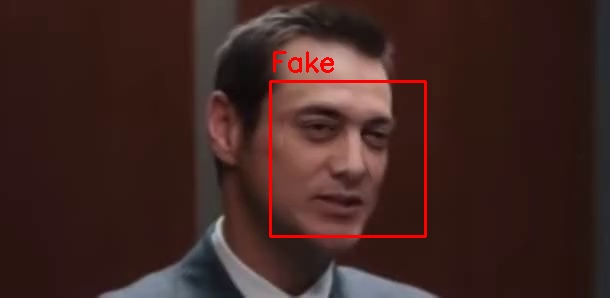

# *Still in progreess* :construction_worker:
# DeepFake detection webapp :busts_in_silhouette:
A Streamlit app that checks an uploaded video for deepfakes.

## How to run locally? :running:
### Clone repo
    git clone https://github.com/Nercules/DeepFake-detection-webapp.git
### Create and activate a venv with the needed dependencies
    conda venv create -f environment.yml
    conda activate venv
### Run the app
    streamlit run main.py
